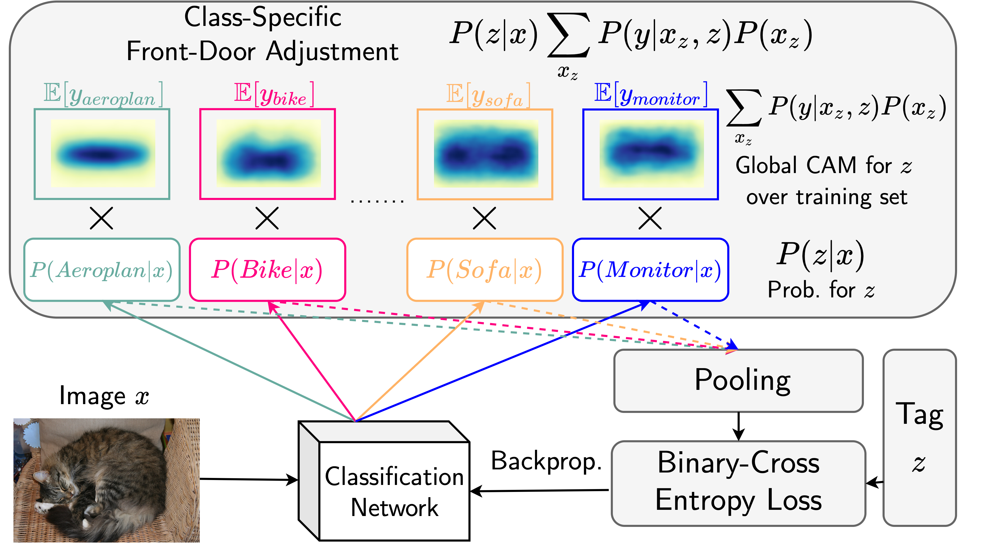

# Causal Class Activation Maps for Weakly-Supervised Semantic Segmentation

- Causal CAM (C^2AM), is a simple yet effective algorithm for enhancing CAM quality. It requires no extra parameters, modification of the classification network architecture, or manipulating of the images. Further, the implementation of C^2AM is also straightforward, it only requires one additional line of code. 
- We evaluated C^2AM on PASCAL VOC 2012 and achieved mIOU 69.5% of the pseudo mask generation on the training set, and mIOU xx.xx% and xx.xx% on validation and test set when training DeepLabV2 on the seed masks.

