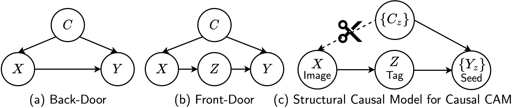

# Causal Class Activation Maps for Weakly-Supervised Semantic Segmentation

- Accepted at [UAI 2022 Causal Representation Learning Workshop](https://openreview.net/group?id=auai.org/UAI/2022/Workshop/CRL#accept--oral-)


- Causal CAM (C^2AM), is a simple yet effective algorithm for enhancing CAM quality. It requires no extra parameters, modification of the classification network architecture, or manipulating of the images. Further, the implementation of C^2AM is also straightforward, it only requires one additional line of code. 

```
# Classification forward pass
x = cls_model(imgs) # x.shape == B * 20 
# Multiply with Global CAM
# x = x.unsqueeze(2).unsqueeze(2) * global_cam # x.shape == B * 20 * H * W
# Mean Pooling
# x = torch.mean(x, dim=(2, 3)) # x.shape == B * 20
# Ours
x = torch.mean(x.unsqueeze(2).unsqueeze(2) * global_cam, dim=(2, 3))
# Loss
loss = torch.nn.BCELoss()(x, labels)
```

- We evaluated C^2AM on PASCAL VOC 2012 and achieved mIOU 69.6% of the pseudo mask generation on the training set, and mIOU 67.5% and 67.7% on validation and test set when training DeepLabV2 on the seed masks.

- Weights are released at [here](https://drive.google.com/drive/folders/1L0ieqx4XWddIUzKP80djM7YOcKeJZDot?usp=sharing).

## Class Activation Map to Segmentation Pipeline


## Structural Causal Models


## Acknowledgement
Code is based on the [IRN](https://github.com/jiwoon-ahn/irn) implemented by [jiwoo-ahn](https://github.com/jiwoon-ahn). 
